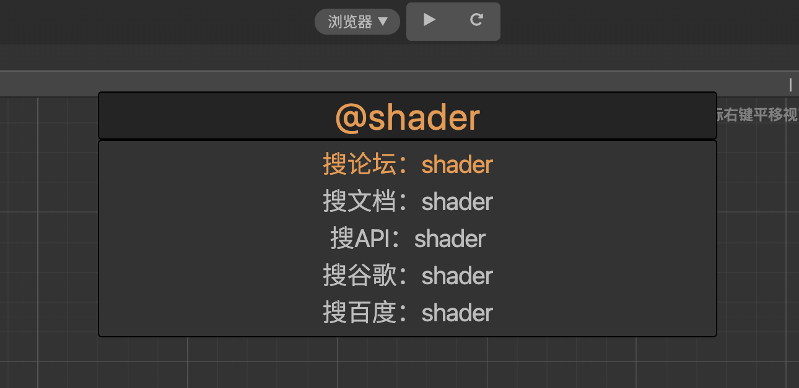

# quick-open-x

## 用途
- 快速搜索打开文件
- 比内置搜索更快！

## 安装
- 有钱：商店下载(1元) https://store.cocos.com/#/resources/detail/2362
- 没钱：clone本项目放置到项目packages目录下

## 使用
- ctrl+o（cmd+o)打开面板
- 将面板拖到creator编辑器内任意位置
- 再次ctrl+o（cmd+o)即可打开搜索框
    
## 快捷键
- `CmdOrCtrl+O` 搜索打开场景、预置体
- `CmdOrCtrl+Shift+O` 搜索定位文件
- `esc` 清空/退出输入框
- `` ` `` 切换长短路径
- 输入 `` @ `` 前缀启用远程搜索模式

## 预览

